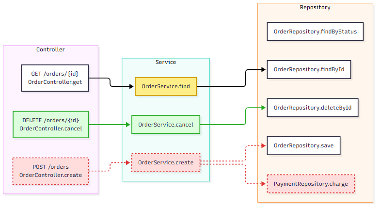

# flowdiffmap

> 부모 커밋 대비 바뀐 메서드 · 호출만 칠한 Spring Boot 요청 흐름도(Controller → Service → Repository)를 커밋마다 쓰는 post-commit 훅

단일 모듈 `src/main/java` 대상 · 앱 실행 없는 소스 정적 분석 · 결과 파일 쓰기까지만 · 커밋은 사람 몫 — 훅 커밋 → 훅 재실행 루프 회피

[](docs/example/request-flow.md)

초록 추가 · 빨강 점선 삭제 · 노랑 본문 변경 — **[산출물 원본](docs/example/request-flow.md)** (Mermaid + 변경 표) · [fixture](src/test/resources/fixture) v1 → v2 두 커밋의 임시 리포 산출물

## 주요 기능

- 작업 폴더가 아닌 커밋된 blob 기준 파싱 — `git add -p` 부분 커밋에도 어긋나지 않는 스냅샷
- 커밋별 스냅샷 PostgreSQL 저장 · 바뀐 파일만 다시 파싱
- 문서 · DTO 만 바뀐 커밋에 덮이지 않는 직전 흐름도
- 부모 커밋 흐름을 이어받는 문법 오류 파일 · DB 다운 뒤 새 베이스라인이 되는 첫 커밋 — 경고는 `.git/flowdiffmap.log`

## 기술 스택

| 구분 | 기술 |
|---|---|
| Language | Java 21 |
| Build | Gradle 9.7 |
| 정적 분석 | JavaParser 3.28 (symbol solver) |
| Database | PostgreSQL 17 · JDBC |
| Test | JUnit 6 · AssertJ · Testcontainers 2 |
| CI | GitHub Actions |

## 실행

Git Bash 기준 · JDK 21 · Docker 필요

```bash
git clone https://github.com/minky5004/flowdiffmap.git && cd flowdiffmap
docker compose up -d                                        # PostgreSQL → localhost:5432
./gradlew installDist                                       # → build/install/flowdiffmap
export FLOWDIFFMAP_HOME="$PWD/build/install/flowdiffmap"    # 새 셸 · IDE 커밋에는 셸 프로필 · OS 환경변수로
TARGET=/path/to/spring-repo
cp hooks/post-commit "$(git -C "$TARGET" rev-parse --path-format=absolute --git-path hooks)/"
```

이후 대상 리포 커밋마다 `docs/flow/request-flow.md` 갱신 · 추적 안 된 파일로 남는 출력

## 구조

```
Main              훅 진입점 · 커밋 blob 풀기 · 부모 대비 비교
ast/              Controller · Service · Repository 판별 · 매핑 · 호출 엣지 추출
graph/            노드 · 엣지 그래프 · 두 커밋 사이 diff
store/            커밋별 스냅샷 저장 · 부모 행 복사 + 바뀐 파일만 교체
render/           Mermaid 흐름도 + 변경 표
hooks/post-commit 훅 스크립트 · 실패해도 종료 코드 0
```
