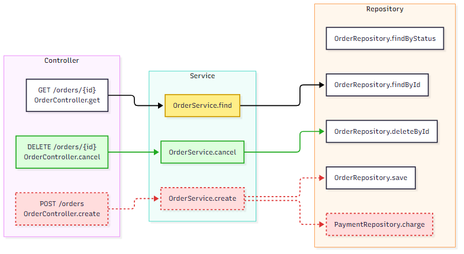
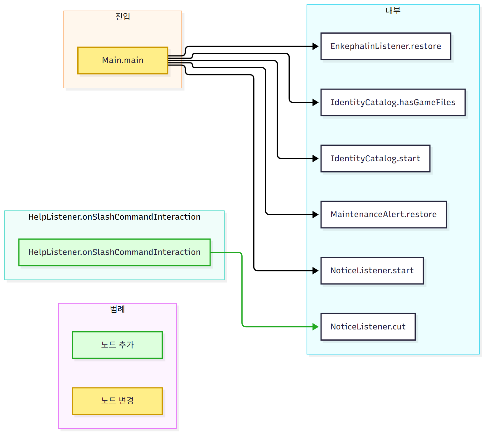

# flowdiffmap

📎 [Notion 정리](https://app.notion.com/p/3e67b7516d7c8183a86fd7a11dc718d9)


> 부모 커밋 대비 바뀐 메서드 · 호출만 칠한 Java 흐름도(Spring Boot 는 Controller → Service → Repository · 그 밖은 main · 리스너 진입점부터)를 커밋마다 쓰는 post-commit 훅

멀티모듈 지원 — 루트 · 빌드 파일 옆 `src/main/java` · 앱 실행 없는 소스 정적 분석 · 결과 파일 쓰기까지만 · 커밋은 사람 몫 — 훅 커밋 → 훅 재실행 루프 회피

[](docs/example/request-flow.md)

초록 추가 · 빨강 점선 삭제 · 노랑 본문 변경 — **[산출물 원본](docs/example/request-flow.md)** (Mermaid + 변경 표) · [fixture](src/test/resources/fixture) v1 → v2 두 커밋의 임시 리포 산출물

[](docs/example/discord-bot-flow.md)

비-Spring 리포 — [DiscordBotPractice](https://github.com/minky5004/DiscordBotPractice) 의 `/help` 추가 커밋 [`84a7d6a`](https://github.com/minky5004/DiscordBotPractice/commit/84a7d6a) · 노드 47개 중 이 커밋에 걸린 8개만 — **[산출물 원본](docs/example/discord-bot-flow.md)**

## 파이프라인

| 단계 | 하는 일 | 산출물 |
| --- | --- | --- |
| 풀기 | 커밋 blob 을 임시 폴더로 — 작업 폴더 아닌 커밋 내용 | 커밋 시점 모든 모듈의 `src/main/java` |
| 추출 | 바뀐 파일 + 그 파일을 부르는 파일 파싱(베이스라인 커밋은 전체) · 레이어 · 진입점 판별 · 호출 resolve | 노드 · 엣지 |
| 저장 | 부모 스냅샷 복사 + 바뀐 파일 행만 교체 · 부모 스냅샷 없는 커밋의 전체 베이스라인 | PostgreSQL 커밋별 스냅샷 |
| 비교 | 부모 대비 추가 · 삭제 · 본문 변경 | diff |
| 렌더 | 바뀐 노드 + 한 단계 이웃(방향마다 5곳 · 넘친 이웃은 `외 N곳` 상자) · 추가 · 삭제된 엔드포인트 · 진입점의 기능 박스 · 범례 | `docs/flow/request-flow.md` |

커밋된 blob 기준의 스냅샷 — `git add -p` 부분 커밋에도 어긋나지 않는 흐름

흐름 diff 없는 커밋(문서 · 흐름 밖 클래스만)에 덮이지 않는 직전 흐름도

부모 커밋 흐름을 이어받는 문법 오류 파일 · 경고는 `.git/flowdiffmap.log`

## 기술 스택

| 구분 | 기술 |
|---|---|
| Language | Java 21 |
| Build | Gradle 9.7 · `application` 플러그인 — 훅이 부르는 Spring 없는 CLI |
| 정적 분석 | JavaParser 3.28 symbol solver — 앱 실행 없이 호출 대상 resolve |
| Database | PostgreSQL 17 · JDBC 직접 (ORM · Flyway 없음 · `schema.sql` 한 장) |
| git | `git` CLI 호출 (JGit 없음) · blob 은 `cat-file --batch` 한 프로세스로 |
| Test | JUnit 6 · AssertJ · Testcontainers 2 · 60개 |
| CI | GitHub Actions |

## 실행

Git Bash 기준 · JDK 21 · Docker 필요

```bash
git clone https://github.com/minky5004/flowdiffmap.git && cd flowdiffmap
docker compose up -d                  # PostgreSQL → localhost:5432 · PC 부팅 뒤 한 번
./gradlew installDist                 # → build/install/flowdiffmap · flowdiffmap 코드 수정 뒤에도
hooks/install.sh /path/to/java-repo   # 대상 리포마다 한 번 · 배포본 경로를 박은 post-commit 훅 · 남의 훅을 덮지 않는 설치
```

이후 대상 리포 커밋마다 `docs/flow/request-flow.md` 갱신 · 추적 안 된 파일로 남는 출력 — 훅 설치 뒤 첫 커밋 · DB 꺼진 커밋 바로 다음 커밋의 전체 그림 · 그 밖의 커밋은 바뀐 부분만 칠한 그림

재설치 대상 — 다른 PC 의 clone · flowdiffmap 폴더 이동 뒤의 대상 리포 (커밋 안 되는 `.git/hooks` 안 훅 · 훅에 박힌 배포본 경로)

흐름도 안 생긴 커밋의 단서 `.git/flowdiffmap.log` — 대개 꺼진 DB

## 구조

```
flowdiffmap/
├── .github/workflows/ci.yml   dev · main push 와 PR 의 빌드 · 러너 Docker 위 Testcontainers
├── docker-compose.yml         로컬 PostgreSQL 17
├── hooks/
│   ├── post-commit            훅 스크립트 · 실패해도 종료 코드 0
│   └── install.sh             배포본 경로를 박은 훅 · 남의 훅을 덮지 않는 설치 스크립트
└── src/main/
    ├── resources/schema.sql   스냅샷 테이블 · CREATE TABLE IF NOT EXISTS
    └── java/flowdiffmap/
        ├── Main.java          훅 진입점 · 커밋 blob 풀기 · 부모 대비 비교
        ├── ast/               Spring 레이어 · 진입점 판별 · 매핑 · 호출 엣지 추출
        ├── graph/             노드 · 엣지 그래프 · 두 커밋 사이 diff
        ├── store/             커밋별 스냅샷 저장 · 부모 행 복사 + 바뀐 파일만 교체 · 읽을 때 진입점 도달 필터
        └── render/            Mermaid 흐름도 + 변경 표
```

추출은 소스 안 모든 클래스 · 거르기는 읽을 때 — Spring 리포 여부는 리포 전체로 정해지는 판단 · 바뀐 파일만 보는 증분 추출이 내릴 수 없는 결정

## 차후 계획

구조(어디가 바뀌었나)만 보이는 그림 · 이유(왜 바뀌었나)는 빈칸 — 커밋 diff 를 AI 로 요약한 한 줄(`주문 취소 기능 추가`)을 그림에 같이 싣는 기능
