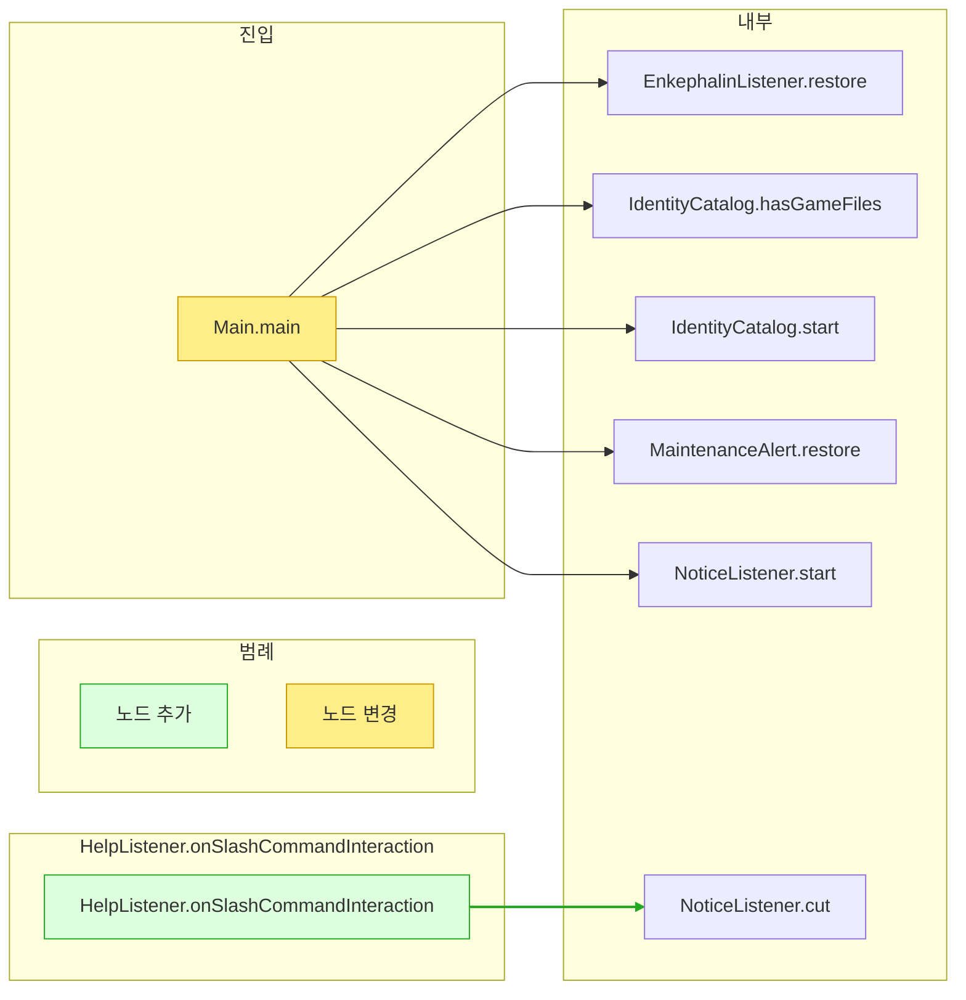

# 요청 흐름 · `84a7d6a`

변경과 무관한 노드 39개 생략

| 구분 | 대상 |
|---|---|
| 기능 추가 | HelpListener.onSlashCommandInteraction |
| 변경 | Main.main |
| 호출 추가 | HelpListener.onSlashCommandInteraction → NoticeListener.cut |
