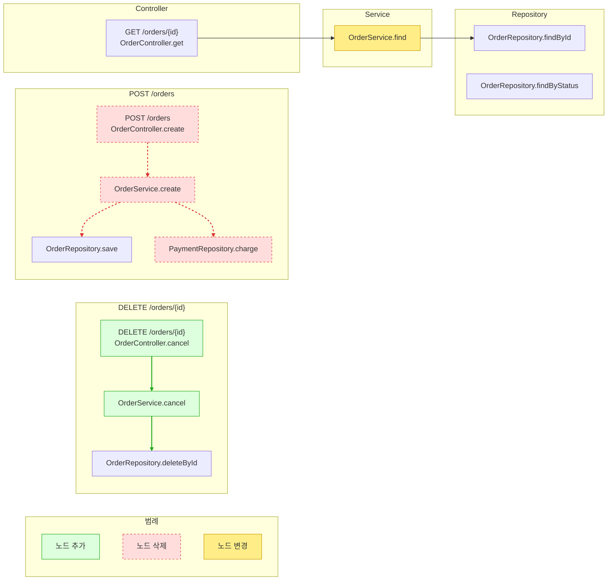

# 요청 흐름 · `9c75e52`

```mermaid
flowchart LR
  subgraph LEGEND["범례"]
    legend_added["노드 추가"]:::added
    legend_removed["노드 삭제"]:::removed
    legend_changed["노드 변경"]:::changed
  end
  subgraph F_shop_order_OrderController_cancel_1["DELETE /orders/{id}"]
    shop_order_OrderController_cancel_1["DELETE /orders/{id}<br/>OrderController.cancel"]:::added
    shop_order_OrderRepository_deleteById_1["OrderRepository.deleteById"]
    shop_order_OrderService_cancel_1["OrderService.cancel"]:::added
  end
  subgraph F_shop_order_OrderController_create_1["POST /orders"]
    shop_order_OrderController_create_1["POST /orders<br/>OrderController.create"]:::removed
    shop_order_OrderRepository_save_1["OrderRepository.save"]
    shop_order_OrderService_create_1["OrderService.create"]:::removed
    shop_order_PaymentRepository_charge_1["PaymentRepository.charge"]:::removed
  end
  subgraph CONTROLLER["Controller"]
    shop_order_OrderController_get_1["GET /orders/{id}<br/>OrderController.get"]
  end
  subgraph SERVICE["Service"]
    shop_order_OrderService_find_1["OrderService.find"]:::changed
  end
  subgraph REPOSITORY["Repository"]
    shop_order_OrderRepository_findById_1["OrderRepository.findById"]
    shop_order_OrderRepository_findByStatus_1["OrderRepository.findByStatus"]
  end
    shop_order_OrderController_cancel_1 --> shop_order_OrderService_cancel_1
    shop_order_OrderController_create_1 --> shop_order_OrderService_create_1
    shop_order_OrderController_get_1 --> shop_order_OrderService_find_1
    shop_order_OrderService_cancel_1 --> shop_order_OrderRepository_deleteById_1
    shop_order_OrderService_create_1 --> shop_order_OrderRepository_save_1
    shop_order_OrderService_create_1 --> shop_order_PaymentRepository_charge_1
    shop_order_OrderService_find_1 --> shop_order_OrderRepository_findById_1
  linkStyle 0 stroke:#2a2,stroke-width:2px
  linkStyle 1 stroke:#d33,stroke-width:2px,stroke-dasharray:4
  linkStyle 3 stroke:#2a2,stroke-width:2px
  linkStyle 4 stroke:#d33,stroke-width:2px,stroke-dasharray:4
  linkStyle 5 stroke:#d33,stroke-width:2px,stroke-dasharray:4
  classDef added fill:#dfd,stroke:#2a2
  classDef removed fill:#fdd,stroke:#d33,stroke-dasharray:4
  classDef changed fill:#fe8,stroke:#c90
```

| 구분 | 대상 |
|---|---|
| 기능 추가 | DELETE /orders/{id} |
| 기능 삭제 | POST /orders |
| 변경 | OrderService.find |
